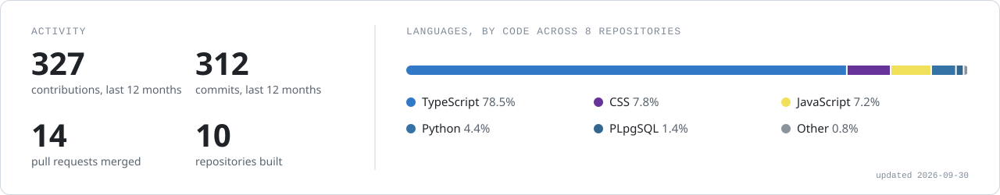

<!-- The images in assets/ are generated by scripts/build-cards.mjs. Edit the script, not the SVGs. -->

<picture>
  <source media="(prefers-color-scheme: dark)" srcset="assets/hero-dark.svg">
  
</picture>

  

 

### Hi, I'm Yog.

I run **[Suprfree](https://suprfree.com/?utm_source=github&utm_medium=profile)**, a group that builds growth and profit infrastructure for Indian brands. I lead the product and write the code, from the database schema and marketplace integrations to the UI and the 3D on our website.

Most of that code lives in private repositories, so the public graph here shows only part of the work.

 

### What I'm building

<table>
  <tr>
    <td width="170"><b><a href="https://suprfree.com/products/suprone?utm_source=github&amp;utm_medium=profile">Suprone</a></b> Profit OS for brands</td>
    <td>The real profit on every order, channel and campaign, in one place. Suprone connects a brand's store, marketplaces, ad accounts and couriers, and shows what is left after returns, RTO, fees, shipping and ad spend. Then it tells you what to fix.</td>
  </tr>
  <tr>
    <td><b><a href="https://cocomomedia.in/mgp">Suprnow</a></b> Merchant growth platform</td>
    <td>Marketing, plumbed into the software merchants already use. POS, billing and commerce platforms integrate once, and every merchant on them can buy growth from inside the product they open every morning.</td>
  </tr>
  <tr>
    <td><b><a href="https://cocomomedia.in">Cocomo</a></b> Growth agency</td>
    <td>Influencer, performance, content and search, run by one team. 250+ brands served, 15,000+ creators on the roster, and an in-house production studio.</td>
  </tr>
</table>

 

### Inside Suprone

A few of the engineering problems I've worked through while building it:

- **Real ROAS, not reported ROAS.** Ad platform claims are reconciled against what actually shipped, stayed delivered and got paid.
- **Marketplace money, reconciled.** Amazon and Flipkart payouts are matched to orders, and every claim is flagged before its deadline.
- **Live data without polling everything.** Webhooks, a background poller and server-sent events keep dashboards current.
- **Shipping and RTO under watch.** Shipments, NDRs and courier delays sit in one queue, with risky orders flagged before they return.
- **WhatsApp journeys that run themselves.** A send queue with retries and guards against over-messaging.
- **Teams and privacy done properly.** Per-module roles enforced on the server, revocable sessions, and DPDP erasure built in.

 

### Stack

<picture>
  <source media="(prefers-color-scheme: dark)" srcset="assets/stack-dark.svg">
  
</picture>

  

### Public work

| Project | What it is |
| --- | --- |
| [**samyak-fashion-jewellery**](https://github.com/Yog-Rajja/samyak-fashion-jewellery) | Storefront and shop manager for a jewellery business. Plain HTML, CSS and vanilla JS with a small Node/Express server, and an admin panel the owner uses to manage stock. |
| [**Smart Companion**](https://github.com/Yog-Rajja/Sem4_Project) | AI goal planner. Describe a goal in plain English and it builds an editable roadmap of milestones, tasks and dates, with real learning resources attached to each step. |

 

### Activity

<picture>
  <source media="(prefers-color-scheme: dark)" srcset="assets/stats-dark.svg">
  
</picture>

  

<picture>
  <source media="(prefers-color-scheme: dark)" srcset="https://raw.githubusercontent.com/Yog-Rajja/Yog-Rajja/output/snake-dark.svg">
  
</picture>

  

How this profile is built

 

No third-party card services. [`scripts/build-cards.mjs`](scripts/build-cards.mjs) reads the GitHub GraphQL API and draws every SVG above: the pixel header, the stack strip and the activity card, each in a dark and a light version. A [workflow](.github/workflows/cards.yml) rebuilds them every morning, and [Platane/snk](https://github.com/Platane/snk) draws the snake. The code is MIT, so fork it and set `HERO_NAME` to draw your own name.

 

Building from India. The easiest way to reach me is <a href="mailto:yog.rajja@suprfree.com">yog.rajja@suprfree.com</a>.

